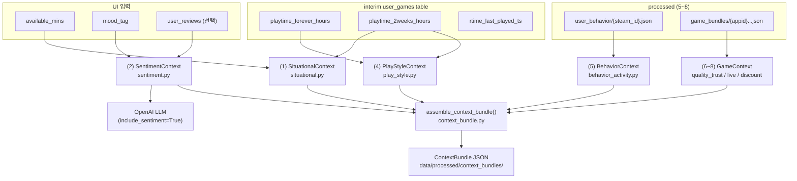

# Context-aware (1~4) 문서 — 상황/감성/행동/스타일 유저 컨텍스트

## 문서 원칙

- 이 문서는 `docs/03-context_aware.md` 의 **모듈 1~4** (유저 컨텍스트)를 구현한 내용을 정리합니다.
- 모듈 5~8 (BehaviorContext, QualityTrust, Live, Discount) 구현은 `docs/03-context_aware_5to8.md` 를 참고하세요.
- 각 모듈은 `src/game_recommendation/context_aware/` 아래 **별도 파일로 분리**되어 있습니다.
- 조립은 `context_bundle.py` 의 `assemble_context_bundle()` 에서 통합 처리합니다.

## 목차

- [0. 담당 범위와 기존 코드 정리 배경](#0-담당-범위와-기존-코드-정리-배경)
- [1. 디렉토리/파일 구조](#1-디렉토리파일-구조)
- [2. 모듈별 상세](#2-모듈별-상세)
  - [2.1 (1) Situational — 상황/시간](#21-1-situational--상황시간)
  - [2.2 (2) Sentiment — 심리/감성 (LLM)](#22-2-sentiment--심리감성-llm)
  - [2.3 (4) Play Style — 플레이 스타일](#23-4-play-style--플레이-스타일)
- [3. context_bundle 통합 (backend 연결)](#3-context_bundle-통합-backend-연결)
  - [3.1 assemble_context_bundle() 파라미터](#31-assemble_context_bundle-파라미터)
  - [3.2 출력 ContextBundle 구조](#32-출력-contextbundle-구조)
  - [3.3 실행 예시](#33-실행-예시)
- [4. 데이터 흐름 요약](#4-데이터-흐름-요약)
- [5. 구현 완료 체크리스트](#5-구현-완료-체크리스트)

---

## 0. 담당 범위와 기존 코드 정리 배경

팀 분배 기준으로 **1~4번**이 이 문서의 담당 범위입니다.

| 번호 | 모듈명 | 파일 | 설명 |
|------|--------|------|------|
| (1) | Situational | `situational.py` | 현재 시간대/요일 + 가용 시간 |
| (2) | Sentiment | `sentiment.py` | 유저 리뷰 LLM 분석 + mood_tag |
| (3) | Behavior | `behavior_activity.py` | *(5번으로 명명, 별도 문서)* |
| (4) | Play Style | `play_style.py` | 플레이 집중도/스타일/난이도 선호 |

> **정리 배경**: 기존 팀원이 1~4를 단일 파일(`context_aware.py`)에 구현했습니다.
> 5~8번처럼 기능별로 분리하고 `context_bundle.py` 조립기와 연결하기 위해 리팩토링했습니다.

---

## 1. 디렉토리/파일 구조

```
src/game_recommendation/context_aware/
├── __init__.py                 # 모듈 구조 주석
├── schemas.py                  # 공용 타입 별칭
│
├── situational.py              # (1) 상황/시간 컨텍스트
├── sentiment.py                # (2) 심리/감성 컨텍스트 (LLM)
├── behavior_activity.py        # (5) 행동/활성도 (5~8 담당)
├── play_style.py               # (4) 플레이 스타일 컨텍스트
│
├── quality_trust.py            # (6) 완성도/신뢰도 (5~8 담당)
├── live.py                     # (7) 라이브 상태 (5~8 담당)
├── discount.py                 # (8) 할인 (5~8 담당)
│
├── game_signals.py             # (6~8) raw→interim→processed (5~8 담당)
├── context_bundle.py           # 전체 조립기 (1~8 통합)
└── topk_demo.py                # Top-K 데모 (5~8 담당)
```

---

## 2. 모듈별 상세

### 2.1 (1) Situational — 상황/시간

**파일**: `src/game_recommendation/context_aware/situational.py`

**목적**: 유저의 현재 여유 시간 + 플레이 습관(최근 2주 기반 세션 추정) + 시간대/요일을 반영해 "세션에 적합한 게임"으로 후보를 좁힌다.

#### 입력

| 파라미터 | 타입 | 출처 | 설명 |
|----------|------|------|------|
| `owned_rows` | `list[dict]` | interim user_games table | `playtime_2weeks_hours` 필드 사용 |
| `available_mins` | `int` | UI 입력 | 지금 플레이 가능한 시간(분) |
| `now_ts` | `int` | 시스템 | UTC Unix timestamp (기본: 현재 시각) |

#### 출력 (SituationalContext)

| 필드 | 타입 | 설명 |
|------|------|------|
| `available_time_window` | `str` | `"30m"` / `"60m"` / `"120m_plus"` |
| `available_mins` | `int` | UI 입력 원본 |
| `average_session_duration_min` | `float` | 최근 2주 playtime 기반 일평균 세션(분) 추정 |
| `current_time_context.is_weekend` | `bool` | 주말 여부 |
| `current_time_context.time_of_day` | `str` | `"morning"` / `"afternoon"` / `"night"` / `"late_night"` |
| `current_time_context.hour` | `int` | UTC 현재 시 |

#### 파생 로직

```
average_session_duration_min =
  mean([game.playtime_2weeks_hours / 7 * 60 for game in recent_games])
```

- `playtime_2weeks_hours / 7` → 일평균 시간 → `× 60` → 분 단위
- 최근 플레이 기록(playtime_2weeks > 0)이 없으면 0.0

#### 호출 예시

```python
from src.game_recommendation.context_aware.situational import compute_situational_context

ctx = compute_situational_context(
    owned_rows,          # interim user_games rows
    available_mins=60,   # UI: 1시간 가능
)
```

---

### 2.2 (2) Sentiment — 심리/감성 (LLM)

**파일**: `src/game_recommendation/context_aware/sentiment.py`

**목적**: 유저의 "판단 기준"(좋아하는 속성)과 "기피 패턴"(churn triggers)을 LLM으로 구조화해 추천/설명에 반영한다.

#### 입력

| 파라미터 | 타입 | 출처 | 설명 |
|----------|------|------|------|
| `user_reviews` | `list[str]` | UI 입력 | 유저가 작성한 리뷰 텍스트 |
| `mood_tag` | `str` | UI 입력 | 현재 기분 (예: `"stress_relief"`, `"immersion"`) |
| `openai_client` | `OpenAI` | 주입 | openai.OpenAI 인스턴스 (선택) |
| `openai_api_key` | `str` | 환경변수/주입 | `openai_client` 없을 때 자동 생성 |

#### 출력 (SentimentContext)

| 필드 | 타입 | 설명 |
|------|------|------|
| `weighted_aspect_preference` | `dict \| None` | 그래픽/스토리/게임플레이/난이도/사운드/멀티플레이 비중 (0~1) |
| `churn_triggers` | `list[str]` | 유저 불호 트리거 (예: `["버그", "짧은 스토리"]`) |
| `current_mood_tag` | `str` | UI 입력 mood_tag 보존 |

#### 운영 메모

- **기본 OFF** (`include_sentiment=False`): LLM 비용이 있어 기본 비활성화.
- `mood_tag`만 있으면 LLM 없이도 `current_mood_tag`만 기록 가능.
- 리뷰 없으면 LLM 호출 없이 빈 컨텍스트 반환.
- LLM 결과는 고정 JSON 스키마 (`aspects`, `churn_triggers`)만 수용.
- 입력 리뷰는 최대 20개까지만 LLM에 전달 (비용/토큰 제한).

#### LLM 프롬프트 구조

```json
{
  "aspects": {
    "graphics": 0.0~1.0,
    "story": 0.0~1.0,
    "gameplay": 0.0~1.0,
    "difficulty": 0.0~1.0,
    "sound": 0.0~1.0,
    "multiplayer": 0.0~1.0
  },
  "churn_triggers": ["string", ...]
}
```

#### 호출 예시

```python
from src.game_recommendation.context_aware.sentiment import compute_sentiment_context

# LLM 활성화 (OPENAI_API_KEY 환경변수 자동 사용)
ctx = compute_sentiment_context(
    user_reviews=["그래픽이 예쁘지만 버그가 너무 많아요."],
    mood_tag="stress_relief",
)

# mood_tag만 기록 (LLM 미사용)
ctx = compute_sentiment_context([], mood_tag="immersion")
```

---

### 2.3 (4) Play Style — 플레이 스타일

**파일**: `src/game_recommendation/context_aware/play_style.py`

**목적**: "이 유저는 어떻게 게임을 플레이하는가?"를 집중도/스타일/난이도 선호로 요약한다.

#### 입력

| 파라미터 | 타입 | 출처 | 설명 |
|----------|------|------|------|
| `owned_rows` | `list[dict]` | interim user_games table | `playtime_forever_hours`, `playtime_2weeks_hours` 사용 |

#### 출력 (PlayStyleContext)

| 필드 | 타입 | 설명 |
|------|------|------|
| `avg_lifetime_hours` | `float` | 게임당 평균 누적 플레이 시간 |
| `focus_score` | `float` | 0~1, 집중도 (최근 2주 / 전체 누적) |
| `play_style` | `str` | `"Focused"` (focus_score > 0.3) / `"Diverse"` |
| `difficulty_pref` | `str` | `"Challenging"` (focus_score > 0.2) / `"Relaxed"` |

#### 파생 로직

```
avg_lifetime_hours = sum(playtime_forever_hours) / game_count
focus_score        = sum(playtime_2weeks_hours) / sum(playtime_forever_hours)
play_style         = "Focused" if focus_score > 0.3 else "Diverse"
difficulty_pref    = "Challenging" if focus_score > 0.2 else "Relaxed"
```

#### 호출 예시

```python
from src.game_recommendation.context_aware.play_style import compute_play_style_context

ctx = compute_play_style_context(owned_rows)
```

---

## 3. context_bundle 통합 (backend 연결)

**파일**: `src/game_recommendation/context_aware/context_bundle.py`

`assemble_context_bundle()` 함수가 모든 모듈(1, 2, 4, 5, 6~8)을 통합해 최종 ContextBundle을 만든다.

### 3.1 assemble_context_bundle() 파라미터

| 파라미터 | 타입 | 기본값 | 설명 |
|----------|------|--------|------|
| `steam_id` | `str` | 필수 | Steam 유저 ID |
| `appids` | `list[int]` | 필수 | 후보 게임 appid 목록 |
| `paths` | `ContextBundlePaths` | 필수 | 데이터 경로 설정 |
| `cc` | `str` | `"us"` | locale (Store API) |
| `lang` | `str` | `"en"` | locale (Store API) |
| `now_ts` | `int \| None` | 현재 시각 | UTC Unix timestamp |
| `include_game_bundle_meta` | `bool` | `True` | 게임 번들 메타 포함 여부 |
| `available_mins` | `int` | `60` | (1) UI 입력: 가용 시간(분) |
| `include_situational` | `bool` | `True` | (1) Situational 포함 여부 |
| `mood_tag` | `str` | `""` | (2) UI 입력: 현재 기분 태그 |
| `user_reviews` | `list[str] \| None` | `None` | (2) 유저 리뷰 텍스트 목록 |
| `include_sentiment` | `bool` | `False` | (2) LLM Sentiment 활성화 여부 |
| `openai_client` | `Any` | `None` | (2) OpenAI 클라이언트 주입 |
| `openai_api_key` | `str \| None` | `None` | (2) API 키 (자동 환경변수 폴백) |
| `include_play_style` | `bool` | `True` | (4) PlayStyle 포함 여부 |

### 3.2 출력 ContextBundle 구조

```json
{
  "meta": {
    "steam_id": "76561198835512557",
    "generated_at": 1700000000,
    "cc": "us",
    "lang": "en",
    "requested_appids": [570, 730],
    "missing_appids": [],
    "stale_appids": []
  },
  "user_id": "76561198835512557",
  "user": {
    "situational": {
      "available_time_window": "60m",
      "available_mins": 60,
      "average_session_duration_min": 42.5,
      "current_time_context": {
        "is_weekend": true,
        "time_of_day": "night",
        "hour": 21
      }
    },
    "sentiment": {
      "weighted_aspect_preference": null,
      "churn_triggers": [],
      "current_mood_tag": "stress_relief"
    },
    "play_style": {
      "avg_lifetime_hours": 35.2,
      "focus_score": 0.145,
      "play_style": "Diverse",
      "difficulty_pref": "Relaxed"
    },
    "behavior": {
      "recent_2weeks_hours": 12.5,
      "total_lifetime_hours": 1240.0,
      "avg_recent_play_hours": 4.2,
      "activity_state": "active",
      "context_anchor_appids": [570, 730]
    }
  },
  "games": {
    "570": {
      "quality_trust": { ... },
      "live": { ... },
      "discount": { ... }
    }
  }
}
```

### 3.3 실행 예시

```python
from src.game_recommendation.context_aware.context_bundle import (
    ContextBundlePaths,
    assemble_context_bundle,
    validate_context_bundle,
    write_context_bundle,
)

paths = ContextBundlePaths()

# 1~8 전체 통합 조립
bundle = assemble_context_bundle(
    steam_id="76561198835512557",
    appids=[570, 730],
    paths=paths,
    # (1) Situational
    available_mins=60,
    # (2) Sentiment — mood_tag만 기록 (LLM 미호출)
    mood_tag="stress_relief",
    include_sentiment=False,
    # (4) PlayStyle — 자동 포함
)

# 검증
issues = validate_context_bundle(bundle)
if not issues:
    out = write_context_bundle(bundle, steam_id="76561198835512557", paths=paths)
    print(f"Bundle saved: {out}")
else:
    print(f"Validation issues: {issues}")
```

LLM Sentiment를 활성화하려면:

```python
bundle = assemble_context_bundle(
    steam_id="76561198835512557",
    appids=[570, 730],
    paths=paths,
    mood_tag="immersion",
    user_reviews=["스토리가 훌륭하지만 버그가 아쉬워요.", "그래픽이 아름답습니다."],
    include_sentiment=True,  # LLM 호출
    # openai_api_key는 OPENAI_API_KEY 환경변수에서 자동 로드
)
```

---

## 4. 데이터 흐름 요약



---

## 5. 구현 완료 체크리스트

- [x] **(1) SituationalContext**: `situational.py` — available_time_window, session 추정, 시간대/요일
- [x] **(2) SentimentContext**: `sentiment.py` — LLM 추출 (optional), mood_tag 보존
- [x] **(4) PlayStyleContext**: `play_style.py` — focus_score, play_style, difficulty_pref
- [x] **schemas.py 업데이트**: SituationalContext, SentimentContext, PlayStyleContext 타입 추가
- [x] **context_bundle.py 통합**: `assemble_context_bundle()` 에 1, 2, 4 모듈 연결
- [x] **validate_context_bundle()**: Situational/PlayStyle 필드 검증 추가
- [x] **기존 context_aware.py 정리**: 리팩토링 완료 후 삭제
